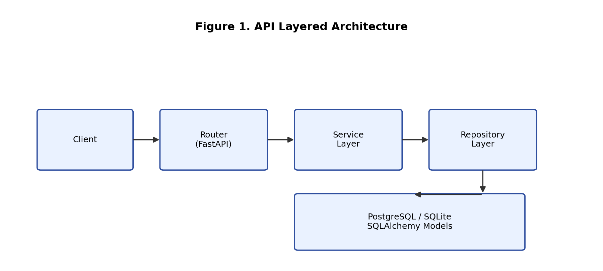
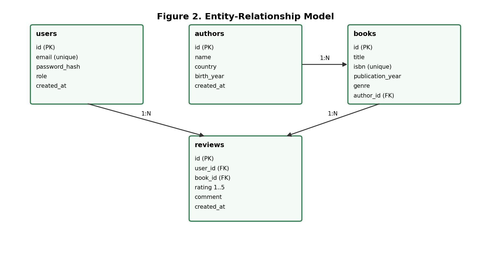
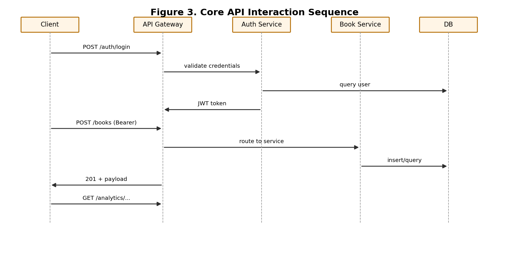
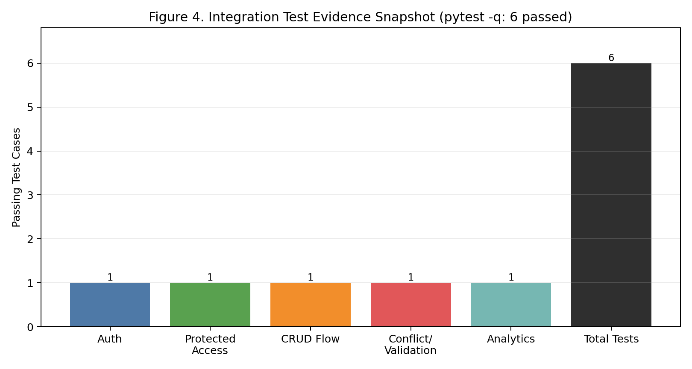

# Technical Report: Book Metadata and Recommendation Analytics API

**Module:** XJCO3011 Web Services and Web Data  
**Assessment:** Coursework 1 (Individual API Development Project)  
**Student Repository:** [https://github.com/Yuk11119/Web_Services_cw1](https://github.com/Yuk11119/Web_Services_cw1)  
**API Documentation (PDF):** [docs/api_documentation.pdf](./api_documentation.pdf)  
**Presentation / Visuals Link (to be finalised in Step 3):** [TBD_SLIDES_LINK](https://example.com/tbd)

## 1. Project Overview
This project implements a data-driven RESTful API for managing book metadata, authors, and reviews, with additional analytics endpoints for genre trends, rating distributions, and recommendation candidates. The work was designed to meet coursework requirements for CRUD functionality, SQL-backed persistence, endpoint documentation, and oral demonstration readiness.

The implemented system supports practical API workflows: user registration and login, protected resource operations, filtered list retrieval, and summary analytics. The API is structured so that each deliverable required by the brief (code repository, API documentation, technical reflection, and oral presentation material) can be traced to concrete project artifacts.

## 2. Stack Justification
The implementation uses **FastAPI + SQLAlchemy + Alembic + JWT authentication + Pytest**.

- **FastAPI** was selected for rapid development, request validation, and automatic OpenAPI generation.
- **SQLAlchemy** provides a clear ORM mapping for core entities and supports relational integrity expected in coursework SQL usage.
- **Alembic** enables schema versioning and reproducible database migration.
- **JWT-based authentication** protects non-public endpoints and demonstrates standard API security practice.
- **Pytest with FastAPI TestClient** supports integration-level verification across auth, CRUD, and analytics flows.

This stack balances delivery speed and engineering rigor, while remaining easy to justify in oral Q&A.

## 3. Architecture and Design Decisions
The project uses a layered backend design:

- **Router layer** (`app/api`) for HTTP contracts and query/route binding.
- **Service layer** (`app/services`) for business logic and validation decisions.
- **Repository layer** (`app/repositories`) for database access concerns.
- **Model/schema layers** (`app/models`, `app/schemas`) for persistence and input/output definitions.

Data model includes `users`, `authors`, `books`, and `reviews` with relational constraints:

- unique `isbn` in books,
- review rating bounded by database check constraint (`1..5`),
- foreign-key relations for referential integrity,
- indexes for common filtering paths.

This decomposition improves maintainability, enables focused testing, and provides clear explainability during the oral exam.



*Figure 1. Layered architecture used in the implementation.*



*Figure 2. Relational model for users, authors, books, and reviews.*

## 4. Implementation Highlights
### 4.1 Core API Capability
Implemented endpoint groups:

- Authentication: `/auth/register`, `/auth/login`
- Authors CRUD: `/authors`
- Books CRUD + filters (`genre`, `year`, `author_id`): `/books`
- Reviews CRUD + filters (`book_id`, `user_id`, `rating`): `/reviews`
- Analytics:
  - `/analytics/genre-trends`
  - `/analytics/rating-distribution`
  - `/analytics/recommendations/{user_id}`

### 4.2 API Contract and Error Handling
Responses use consistent envelopes:

- success: `{ "data": ..., "meta": ... }`
- error: `{ "error_code": ..., "message": ..., "details": ... }`

Custom application exceptions are mapped to appropriate status codes (e.g., `400`, `401`, `404`, `409`, `422`), improving API clarity and client integration behavior.



*Figure 3. Typical request flow from login to protected CRUD/analytics usage.*

### 4.3 Deployment Readiness
`README.md` provides local run instructions and production-oriented deployment notes (Render-style setup with environment variables and migration command before startup).

## 5. Testing Strategy and Evidence
Testing focuses on integration behaviors aligned with coursework marking priorities:

- authentication success/failure,
- protected-route access control,
- CRUD end-to-end flow,
- duplicate ISBN conflict path,
- validation failure path,
- analytics endpoint responses.

Latest test evidence (local run):

```text
pytest -q
6 passed
```

This verifies implemented features are functional and consistent with documented behavior.



*Figure 4. High-level integration test evidence summary.*

## 6. Challenges and Lessons Learned
Main implementation challenges were:

1. Keeping response/error contracts uniform across multiple routers.
2. Maintaining SQL compatibility for aggregation/recommendation queries.
3. Ensuring practical testability while keeping architecture modular.

Key lessons learned:

- enforcing explicit service/repository separation reduces debugging cost,
- writing integration tests early prevents contract drift,
- concise error-code conventions significantly improve API usability.

## 7. Limitations and Future Work
Current limitations:

- recommendation logic is heuristic and not personalized by collaborative filtering,
- no external production dataset pipeline is integrated yet,
- baseline security is implemented, but advanced controls (rate limiting, audit logging, refresh-token rotation) are not fully developed.

Planned improvements:

- add dataset ingestion jobs (scheduled ETL),
- expand test coverage (service-level unit tests and negative analytics cases),
- strengthen production hardening (observability, security policies, and load/performance profiling).

## 8. Dataset and Licensing
Current implementation includes a small seeded dataset for demonstration (`scripts/seed_data.py`) and does not redistribute any proprietary dataset bundle.

For coursework-scale extension, suitable academic-use sources include:

- Open Library datasets/APIs,
- Google Books API metadata,
- Kaggle book metadata collections (license-dependent).

Before final production use, each selected dataset must be recorded with exact source URL and license terms in the final submission appendix.

## 9. GenAI Declaration and Reflection
GenAI was used as an assistive engineering tool in a declared manner.

| Tool | Primary Purpose | Human Verification Method | Outcome |
|---|---|---|---|
| ChatGPT/Codex assistant | Project planning, architecture shaping, endpoint/test scaffolding | Manual code review, local execution, endpoint-by-endpoint checks | Faster iteration with preserved author control |
| GenAI drafting support | Technical report language refinement | Cross-check against actual repository files and test output | Clearer academic writing without changing factual claims |

Integrity statement:

- AI-assisted output was treated as a draft proposal, not an unquestioned final artifact.
- Final decisions, implementation adjustments, test execution, and submission responsibility remained with the student.
- Claims in this report are constrained to implemented behavior observable in the repository.

GenAI evidence references are provided in:

- `docs/genai_declaration_appendix.md`
- `docs/genai_logs/` (summary logs, test evidence, and exported conversation examples)
